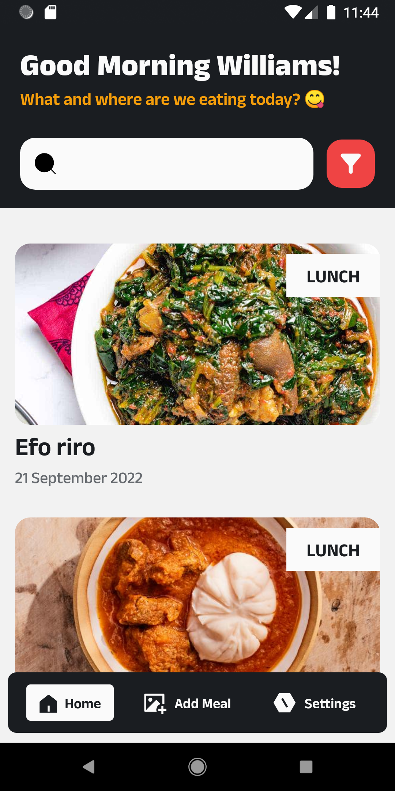
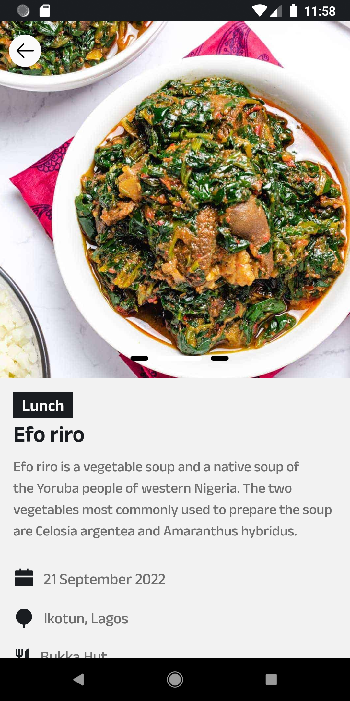
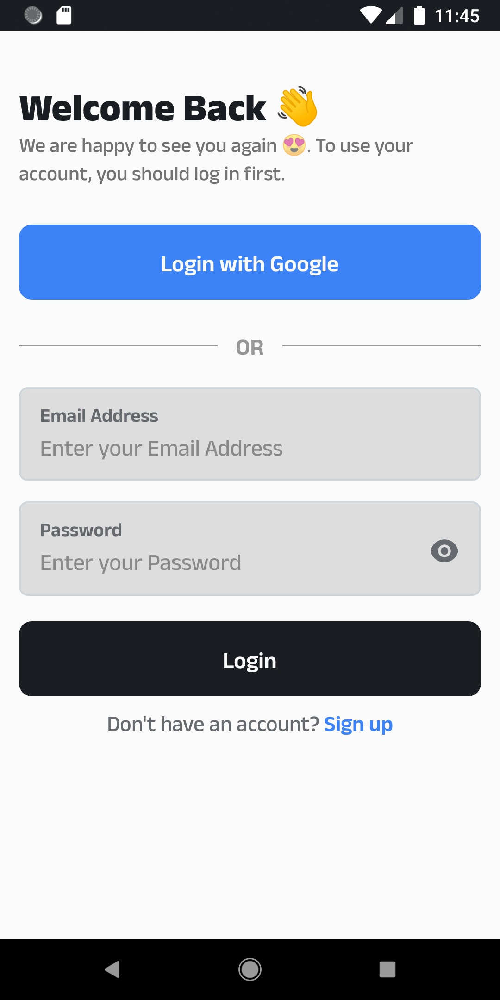

# Food Journal Tracker

### _Track your eating habits, reflect today_

The _Food Journal Tracker_ app is an React native mobile application that can be used to capture photos and information about what you eat. Keeping track of the food you eat is a proven way to make better diet choices. As an added benefit, many popular mobile apps - including Instagram - work in a similar way to the food journaling app.

- The user can take a photo of whatever they are eating or drinking using their phone inbuilt camera.
- The user can then add a description of the food to accompany the photo.
- The user can browse through all the photos and descriptions they have added by swiping up or down.

You can also:

- Import and save files from your phone local storage or gallery.
- Delete and update journals.
- Filter by category.

Remember what you've been eating in the last few days and identify healthy and unhealthy eating patterns.

## Tech

The app uses different libaries, languages, and tools to work properly. Main technologies:

- **React Native**
- **Firebase**
- **Typescript**

## Installation

The Food Journal Tracker requires to [setup your development environment](https://reactnative.dev/docs/environment-setup) with react native to run.

Clone this repository and import into your preferred code editor.

For more information on how to run the app on a real device or an emulator after importing it, follow this [tutorial](https://reactnative.dev/docs/environment-setup).

**Any feedback is always welcome!**
